# 🐾 Chatbot Veterinário — Agendamento via WhatsApp

Chatbot em Python que automatiza o agendamento de exames/consultas de uma
clínica veterinária diretamente pelo WhatsApp — do primeiro contato do
tutor até a confirmação, sincronizando tudo com Google Calendar e Google
Sheets em tempo real.

> Projeto em produção para uma clínica cliente. Este repositório é uma
> **vitrine** do projeto: mostra funcionalidades, arquitetura e
> demonstrações de uso. O código-fonte principal não é público — veja
> [Licença](#-licença) abaixo.

---

📄 **Quer ver mensagem por mensagem como cada opção do menu funciona?**
Confira [docs/FUNCIONAMENTO.md](chatbot-veterinario/docs/FUNCIONAMENTO.md) — o passo a passo
completo das opções 1 a 5, com as mensagens reais trocadas entre bot e
cliente.

## 🎬 Demonstração

Fluxo completo — cadastro, agendamento e confirmação, direto pelo WhatsApp:

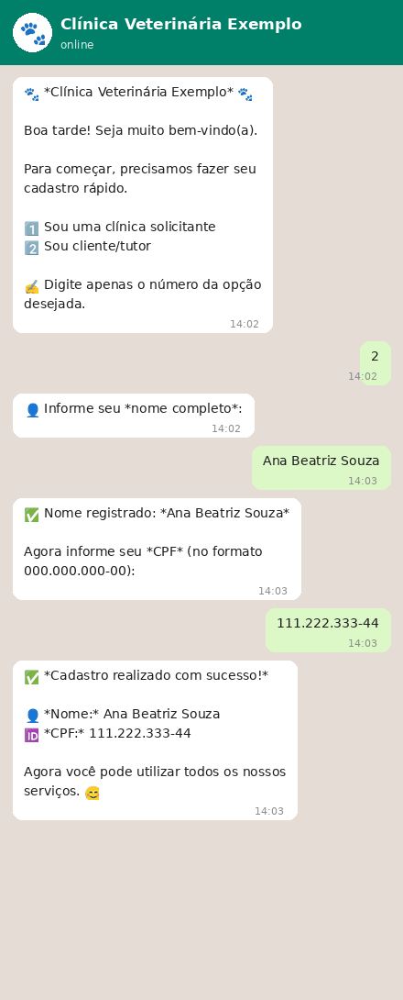

*Conversa simulada com dados fictícios, reproduzindo o fluxo real do bot.*

| Cadastro do tutor | Cadastro de clínica | Menu principal |
|---|---|---|
| 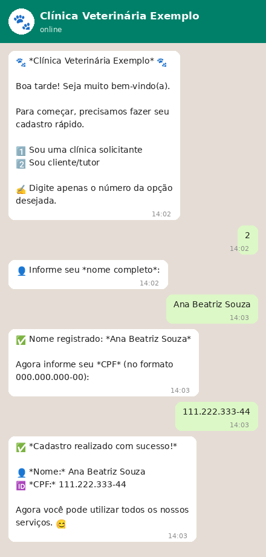 | 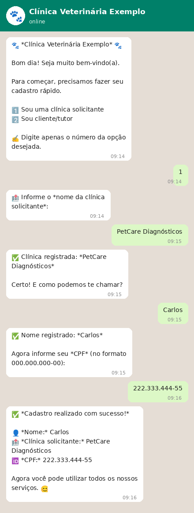 | 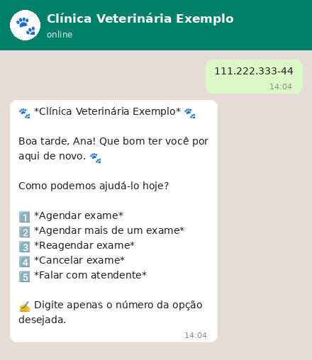 |

| Escolha de data/horário | Ficha e confirmação | Agendar 2 exames |
|---|---|---|
| 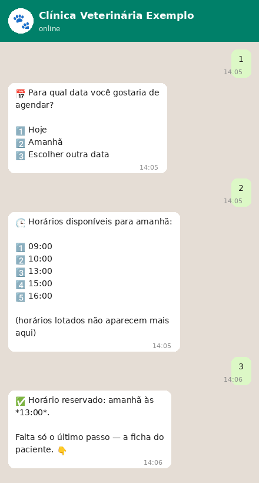 | 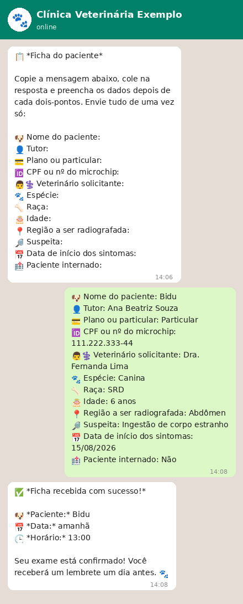 | 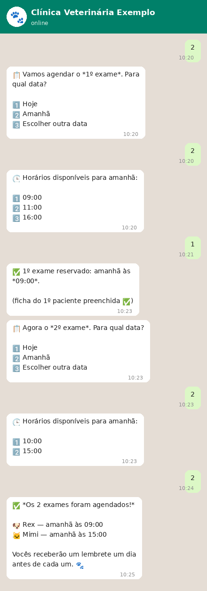 |

| Reagendar | Cancelar | Falar com atendente |
|---|---|---|
| 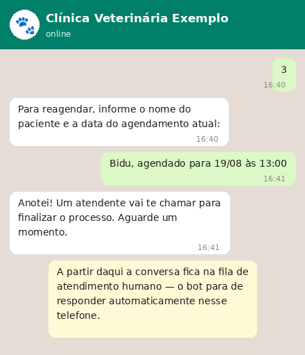 | 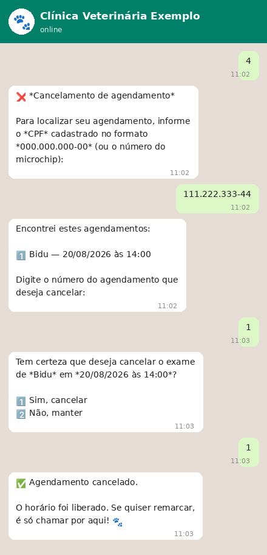 | 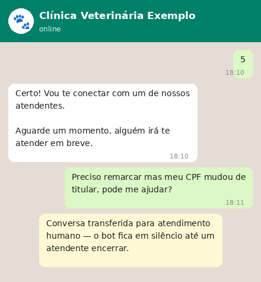 |

Lembrete automático enviado 1 dia antes do exame:

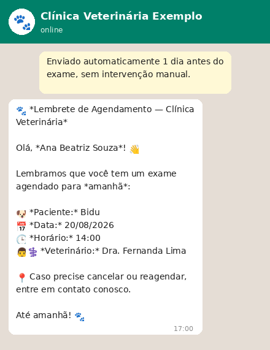

Painel administrativo (Flask) usado pela clínica para controlar o WAHA
e acompanhar os agendamentos — captura real da tela:

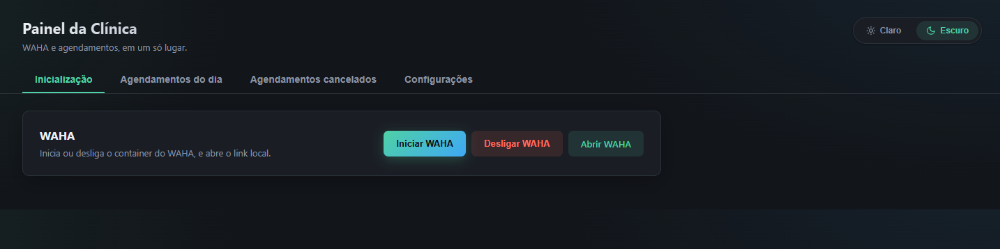

*Aba "Inicialização" — inicia/desliga o container do WAHA e abre o
link local. As demais abas cuidam de agendamentos do dia, cancelados e
configurações.*

---

## ✨ Funcionalidades

- **Atendimento 100% pelo WhatsApp**, via [WAHA](https://waha.devlike.pro/)
  (WhatsApp HTTP API) — sem depender de número comercial pago
- **Cadastro guiado** do tutor (nome, CPF/microchip) com validação de CPF
  (dígitos verificadores) antes de liberar o menu
- **Agendamento de exames** com verificação de disponibilidade em tempo
  real — horários lotados somem do menu automaticamente
- **Reagendamento e cancelamento** localizando o agendamento pelo CPF/
  microchip do paciente
- **Sincronização dupla**: cada agendamento cria um evento no
  **Google Calendar** e uma linha no **Google Sheets**, e o bot também
  reconhece eventos criados manualmente direto na agenda (fora do bot)
  como horários ocupados
- **Lembrete automático** um dia antes do exame
- **Painel web (Flask)** com abas de Inicialização (controle do WAHA),
  Agendamentos do dia, Agendamentos cancelados e Configurações — tudo
  sem precisar mexer em código
- **Persistência local em SQLite**, com migração automática de schema
  (sem perder dados existentes a cada atualização)
- **Empacotável em executável único** (PyInstaller) para rodar no Windows
  da clínica sem precisar instalar Python

## 🏗️ Arquitetura

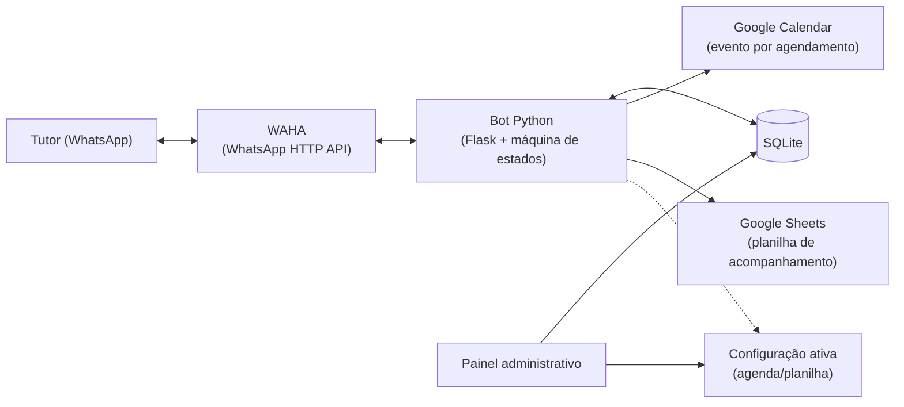

A conversa é conduzida por uma **máquina de estados** guardada por
telefone no banco — cada mensagem recebida avança o cliente para o
próximo passo (cadastro → escolha de data → horário → confirmação).

## 🧱 Stack

| Camada        | Tecnologia                         |
|---------------|-------------------------------------|
| Linguagem     | Python 3.11+                        |
| Servidor      | Flask                               |
| WhatsApp      | WAHA (Docker)                       |
| Banco de dados| SQLite                              |
| Agenda        | Google Calendar API (OAuth 2.0)     |
| Planilha      | Google Sheets API                   |
| Empacotamento | PyInstaller (build para `.exe`)     |

## 📌 Status

Projeto em uso ativo por uma clínica real.

## 📜 Licença

Este repositório é público apenas para fins de **demonstração e
portfólio**. Visualizar é permitido; copiar, reutilizar ou redistribuir
o código, a documentação ou os materiais aqui presentes não é —
veja [LICENSE](LICENSE) para os termos completos.

Interessado no projeto ou em algo parecido para o seu negócio? Entre em
contato.

